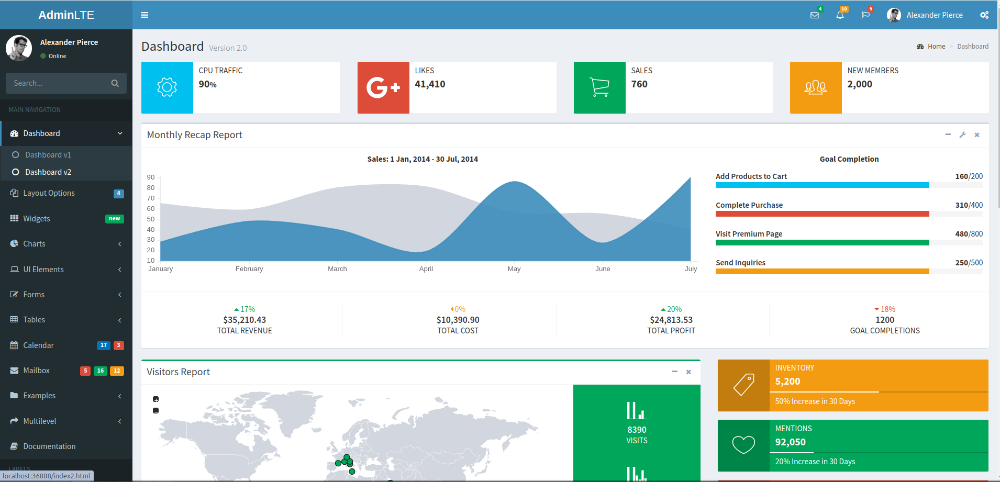

# AdminLTE HTML Template

This is an HTML5 Template for AdminLTE theme, wrapped in a Docker container.

## Getting Started

Run the following command(s):

```shell
./docker-build.sh
./docker-connect.sh
```

```shell
➜  AdminLTE-HTML-Dashboard git:(main) ✗ ./docker-connect.sh        
Web:    http://localhost:36888
root@adminlte:/var/www/html# 
```
Navigate to http://localhost:36888 in your browser.

Happy coding! 🎉



